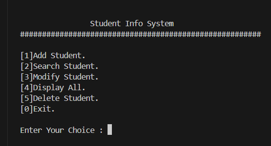
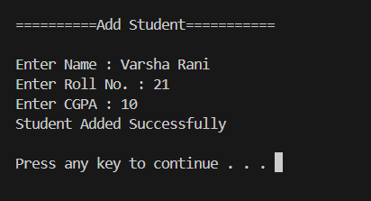

#  Student Record Management System in C

- **Submitted by:** `VARSHA RANI`  
- **Company:** `CODTECH IT SOLUTIONS`  
- **ID:** `CT04DF280`  
- **Domain:** `C Programming`  
- **Internship Duration:**  `May 30th, 2025` – `June 30th, 2025`

---

##  Project Overview

This is a **simple console-based Student Record Management System** written in C using **file handling**.  
It enables the user to perform the following operations:

- **Add** a new student  
- **Display** all student records  
- **Search** a student by roll number  
- **Modify** existing student details  
- **Delete** a student record  

Each student record includes:
-  Name
-  Roll Number (unique)
-  CGPA (validated)

All data is saved persistently in a file called `student.txt`.

---

## Screenshots

  <table>
    <tr>
      <td></td>
      <td></td>
    </tr>
  </table>

---

##  Features

- Add student with validation:
- Unique roll number
- Valid CGPA (0.0 to 10.0)
- Display all students in a formatted table
- Search student by roll number
- Modify student details
- Delete student by roll number
- Persistent file storage using `student.txt`

---

##  Tech Stack
>  C Language
